# TaskPilot

A local-first personal work agent. TaskPilot accepts goals expressed in natural
language, plans multi-step work, and executes it using controlled tools — web
research, workspace file management, task tracking, sandboxed Python execution,
and browser automation — pausing for your approval before anything consequential.
It runs entirely on local infrastructure via [Ollama](https://ollama.com); no
paid LLM API is required.

> **Status:** All 7 implementation phases complete — see
> [Implementation phases](#implementation-phases) below. Verified end-to-end
> against the real deployed Docker Compose stack with a real local model,
> including approval gates that genuinely block a real side effect, and a real
> backend-container restart mid-run that the agent correctly recovers from.

## Architecture

- **Backend** — FastAPI + SQLAlchemy 2.x + Alembic (SQLite) + LangGraph for the
  agent execution graph + Ollama for local inference + Playwright for browser
  automation.
- **Frontend** — React + TypeScript + Vite + Tailwind CSS + shadcn-style
  components + Radix UI + TanStack Query.
- **Python runner** — a separate FastAPI service that owns the Docker socket
  and is the only component that can spawn sandboxed containers to execute
  agent-generated Python scripts. The main backend never touches Docker
  directly.

See [docs/architecture.md](docs/architecture.md) for the full design: the
12-node agent execution graph, the database schema, the tool contract, and how
the pieces fit together. [docs/agent-workflow.md](docs/agent-workflow.md) walks
through what actually happens, node by node, when you submit a goal — including
what to realistically expect from a local model's planning latency.
[docs/security.md](docs/security.md) states the actual enforced boundaries and,
just as importantly, where they're honestly incomplete.
[docs/tool-development.md](docs/tool-development.md) is a guide to adding a new
tool. [docs/local-setup.md](docs/local-setup.md) covers setup and
troubleshooting in more depth than this README.

## Project structure

```
taskpilot/
├── backend/         # FastAPI app, agent graph, tools, Alembic migrations
├── frontend/        # React + Vite + Tailwind + shadcn-style components
├── python-runner/    # Isolated Python execution supervisor (Docker-socket owner)
├── docker/          # Dockerfiles + Compose configuration
├── workspace/        # Agent-managed files (documents, research, scripts, reports, exports)
└── docs/             # Architecture, agent workflow, security, tool development, setup
    └── screenshots/  # Screenshots used in the User guide below
```

## Prerequisites

- Python 3.11+ (developed against 3.13)
- Node.js 20+ / npm
- [Ollama](https://ollama.com), running locally with a model pulled (default:
  `qwen3:4b` — `ollama pull qwen3:4b`)
- Docker + Docker Compose (for the containerized Python execution sandbox and
  for `docker compose up`)

## Quick start (Docker Compose)

```bash
cp .env.example .env   # adjust as needed
docker compose -f docker/compose.yaml up --build
```

Brings up `backend` (`127.0.0.1:8000`), `frontend` (`127.0.0.1:5173`), and
`python-runner` (not published to the host — reachable only from `backend`
over an internal Docker network). On macOS, the backend reaches host-native
Ollama via `host.docker.internal`, already wired in `docker/compose.yaml`.
Open `http://127.0.0.1:5173`. See
[docs/local-setup.md](docs/local-setup.md) for verifying health, running
without Docker, and troubleshooting.

## User guide

A walkthrough of every screen, using a real example end to end: researching a topic,
drafting a couple of documents, running a calculation, and hitting the approval gate
that's the whole point of this tool. Screenshots below are from the actual running
app (`docs/screenshots/`), not mockups.

### 1. Overview — see what's going on at a glance

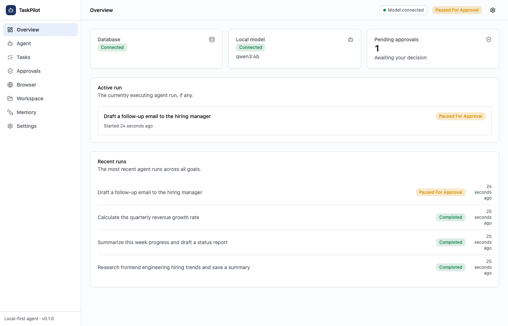

The first thing you see: whether the database and local model are reachable, how many
approvals are waiting on you, the run currently executing (if any), and recent history.
Here, three goals have already completed — a research summary, a status report, and a
Python calculation — and a fourth is paused, waiting on a decision. Click any run to
jump straight to it.

### 2. Agent — submit a goal

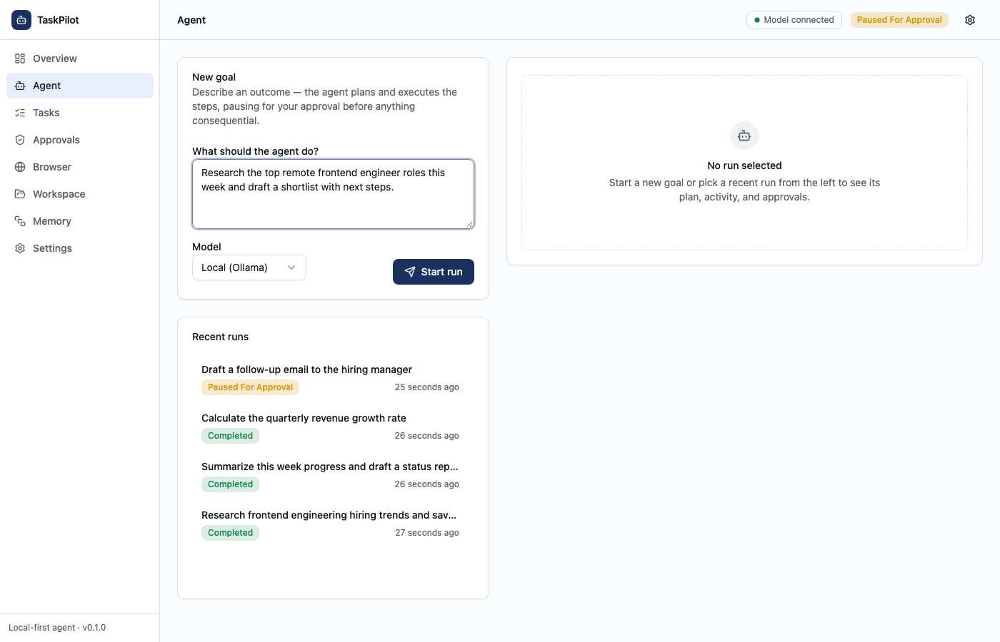

Describe an outcome in plain language on the **Agent** tab, pick a model (your local
Ollama model, or the deterministic `test` provider for demos/development), and hit
**Start run**. This call blocks until the agent finishes, fails, or needs your
approval — a real local model can genuinely take anywhere from under a minute to
several minutes depending on how involved the goal is, so the button shows a loading
state ("Planning…") for the whole wait rather than pretending it's instant.

### 3. The approval gate — the core safety feature

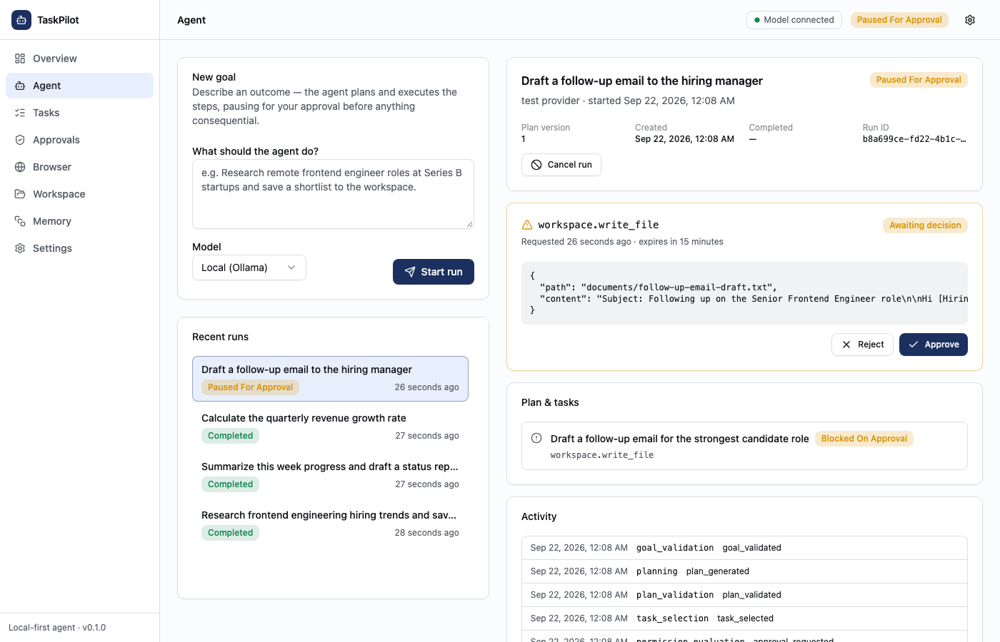

This is what makes TaskPilot safe to let run on your own files: before anything
consequential happens — writing a file, running a script, submitting a form — the
agent stops and shows you **exactly** what it's about to do, unredacted, with the real
arguments it plans to use. Nothing happens until you click **Approve** or **Reject**.
This isn't a UI-only check; it's enforced server-side (see
[Security model](#security-model)) — there's no way for the agent to skip this step,
and the tool genuinely does not run until you say so.

### 4. A completed run — plan, execution, and activity log

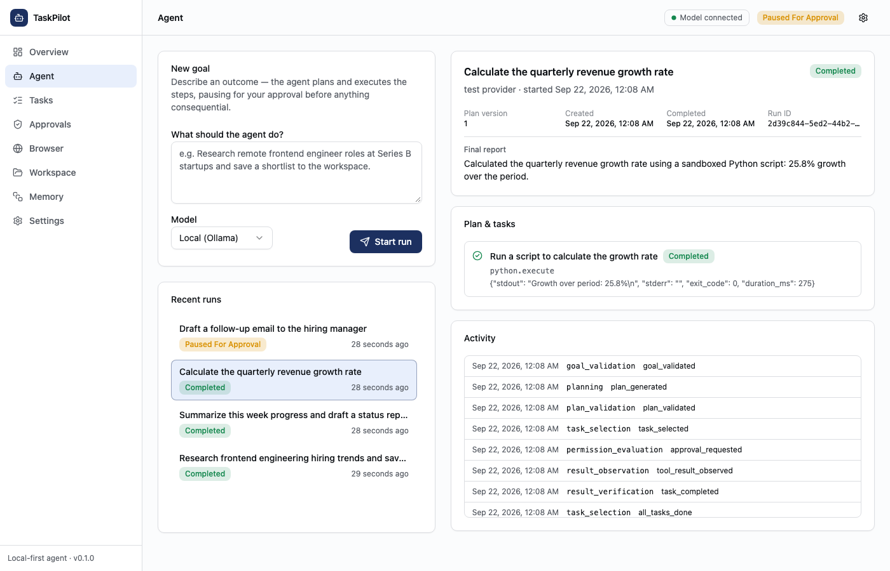

Once a run finishes, you get a plain-language final report, the plan it actually
executed (here, a single task that ran a calculation inside the sandboxed Python
runner and returned real `stdout`/`exit_code`), and a full activity log of every node
the agent's execution graph passed through — useful when you want to understand
*why* it did something, not just *what* it did.

### 5. Approvals inbox — decide from one place

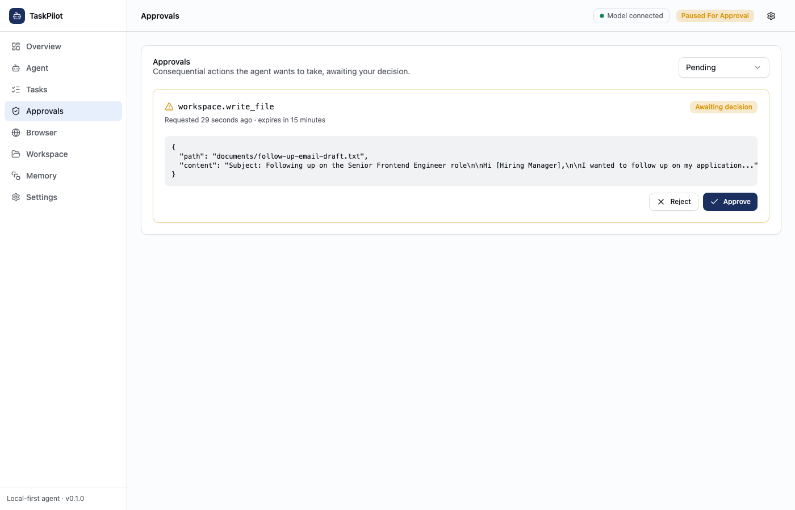

Every pending decision across every run, in one inbox — handy if you've kicked off
more than one goal and don't want to hunt through the Agent tab for what's waiting on
you. Filter by status (pending/approved/rejected/expired) to review history too.

### 6. Tasks — every step, across every run

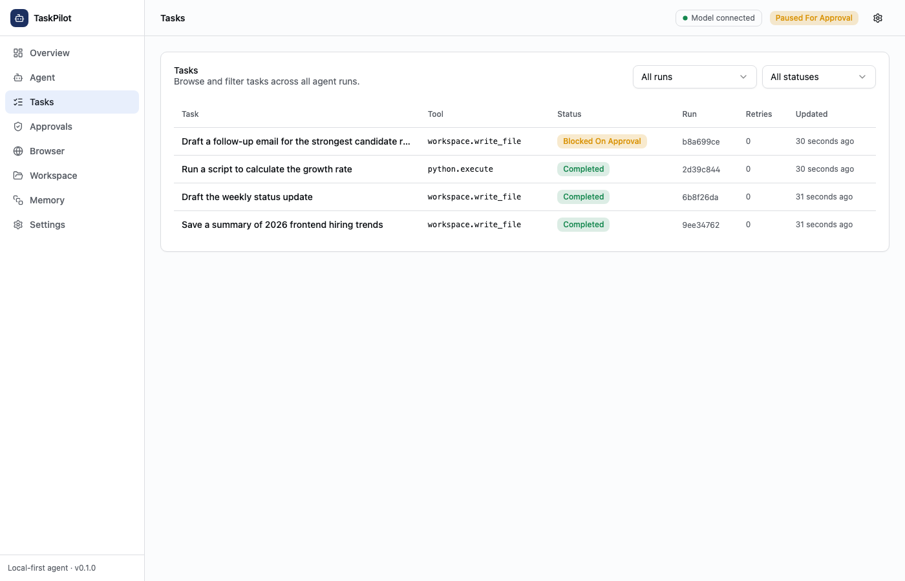

A flat, filterable view of every task the agent has ever planned — which tool it
used, its current status (including `Blocked On Approval` for the one still waiting),
and how many times it's been retried. Filter by run or by status to zero in on
anything that failed or is stuck.

### 7. Workspace — browse what the agent created

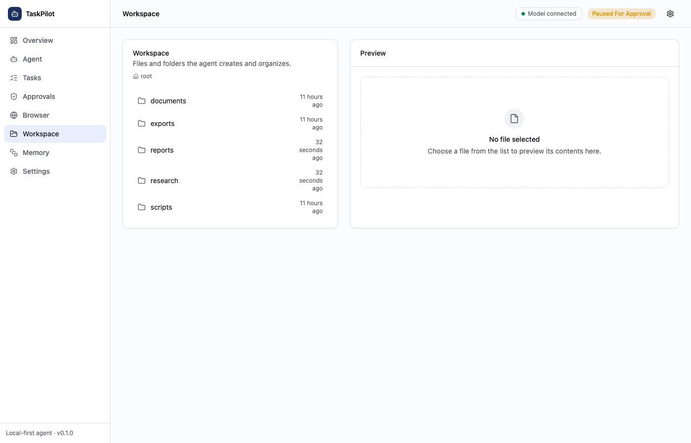

Everything the agent writes lands in one workspace, organized into the same
folders every run shares (`documents/`, `research/`, `reports/`, `scripts/`,
`exports/`). Click into any folder to browse; every path here is the same one the
agent's own tools are restricted to — there's no way for it to write outside this
tree (see [Security model](#security-model)).

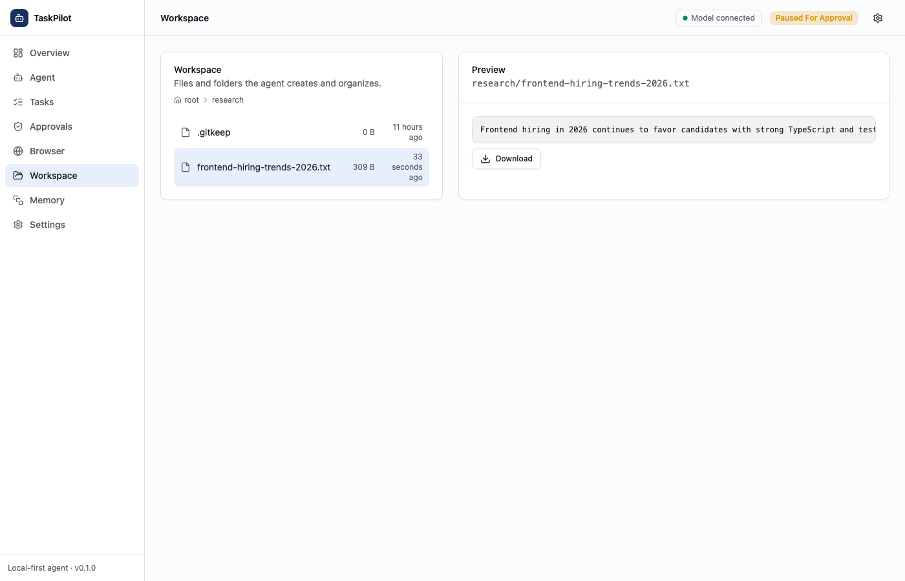

Click a file to preview it in place — text files render directly, images preview
inline, anything else gets a download link.

### 8. Memory — preferences that actually stick

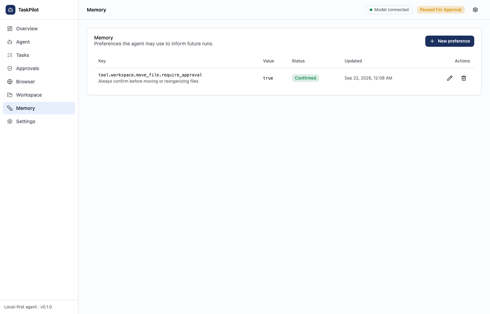

Preferences you explicitly confirm here — never anything inferred automatically —
can adjust how cautious the agent is for future runs. The one thing a preference can
never do is make the agent *less* careful: it can only raise a tool's approval
requirement above its built-in default, never lower it. This example asks the agent
to always confirm before reorganizing files, even though `workspace.move_file` is
auto-approved by default.

### 9. Settings — what's actually configured

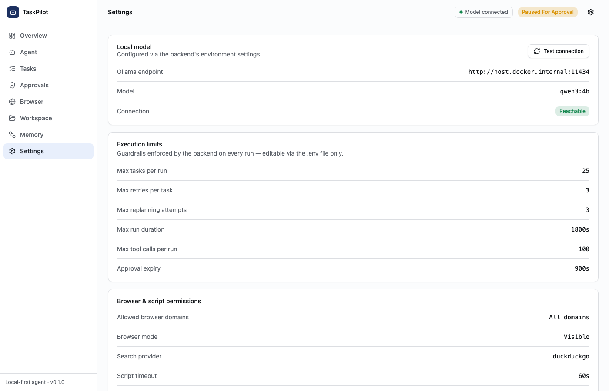

A read-only view of the real configuration in effect — which model you're talking to
and whether it's reachable, the execution guardrails (max tasks per run, retry
limits, run duration, approval expiry), and the browser/script permission defaults.
Everything here comes from `.env`; see [docs/local-setup.md](docs/local-setup.md) to
change it.

### 10. Browser — session visibility when the agent goes online

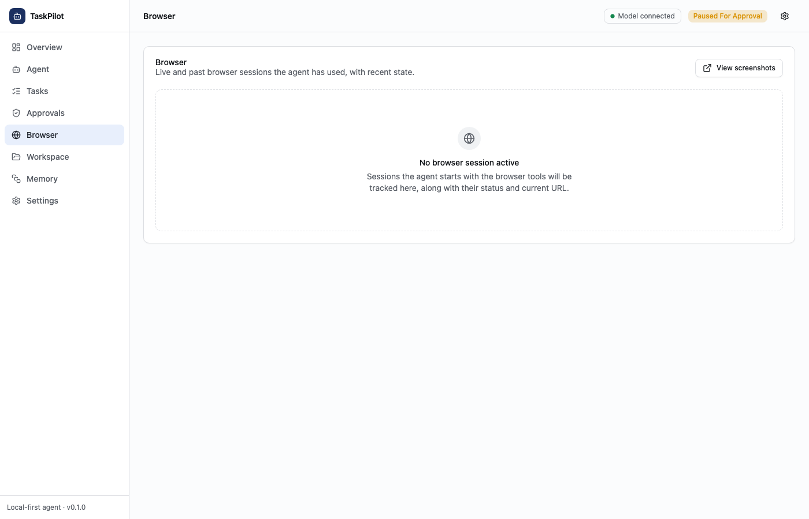

When a goal involves browsing the web interactively (as opposed to the lighter-weight
search/fetch tools used for research), each session the agent opens — and its current
URL — is tracked here. Shown empty here since none of this walkthrough's example goals
needed it; screenshots the agent takes mid-session are always reachable from the
Workspace tab too.

## Local development (without Docker)

### Backend

```bash
cd backend
python3 -m venv .venv && source .venv/bin/activate
pip install -e ".[dev]"
alembic upgrade head
uvicorn app.main:app --reload
```

The API is served at `http://127.0.0.1:8000`, docs at `/docs`, health check at
`/api/v1/health`.

### Frontend

```bash
cd frontend
npm install
npm run dev
```

The UI is served at `http://127.0.0.1:5173` and proxies `/api/*` requests to
the backend at `http://127.0.0.1:8000`.

## Database migrations

Migrations live in `backend/alembic/`. After changing a model in
`backend/app/db/models/`:

```bash
cd backend && source .venv/bin/activate
alembic revision --autogenerate -m "describe the change"
alembic upgrade head
```

## Testing

```bash
# Backend — deterministic, no Ollama/Docker required
cd backend && source .venv/bin/activate && pytest

# Python sandbox — needs a real Docker daemon (spins up real containers)
cd python-runner && source .venv/bin/activate && pytest

# Frontend — Vitest + Testing Library, API mocked via MSW
cd frontend && npm test
```

All three suites are deterministic and don't need Ollama running. The backend
suite drives the real LangGraph execution graph through a scripted,
deterministic LLM provider — no network calls anywhere — which is what makes
retries, replanning, interrupt/resume, and duplicate-execution prevention
testable without a real model at all.

## Security model

TaskPilot has real access to your local files, can execute arbitrary Python,
and can drive a real browser. Full detail, including the honestly-stated
limitations, in [docs/security.md](docs/security.md); the short version:

- All workspace filesystem operations are restricted to the configured
  workspace root through one shared resolver; path traversal and symlink
  escapes are rejected.
- Tool permissions are enforced deterministically in backend code — the LLM
  only ever emits a tool name and arguments, never a permission decision — and
  a user preference can only ever *raise* a tool's approval requirement, never
  lower it.
- Consequential actions require explicit human approval, enforced
  server-side and bound to the exact action payload via a content hash that's
  recomputed and compared at resolution time, not just at request time.
- Python scripts run in ephemeral, network-isolated Docker containers with
  real enforced memory/CPU/process limits, spawned by a dedicated supervisor
  service that is the only component with Docker socket access — a real but
  documented limitation (root-equivalent host access), not a claim of a
  perfect security boundary.
- `backend` and `frontend` bind to `127.0.0.1` by default; `python-runner` is
  not exposed to the frontend or the host at all.

## Known limitations

- The Python sandbox's supervisor has root-equivalent host access via the
  Docker socket, and the sandboxed container's writable filesystem has no
  size cap (not reliably enforceable on the default overlay2 setup this
  project targets). Both documented in
  [docs/security.md](docs/security.md#the-python-sandbox--a-real-honestly-documented-limitation).
- Real local-model planning latency for complex, multi-part goals is
  significant and sometimes unreliable on commodity hardware — see
  [docs/agent-workflow.md](docs/agent-workflow.md#real-model-latency-honestly).
  This is a genuine model/hardware capability constraint, not a bug.
- No multi-tenant/auth model — this is a single-user, local-first tool by
  design, not an oversight.
- The frontend's "live" progress view is polling-based, not a websocket push
  (a deliberate simplicity trade-off — see
  [docs/architecture.md](docs/architecture.md#frontend)).

## Implementation phases

1. **Foundation** — project scaffolding, database schema + migrations, health
   check, Docker Compose, frontend shell.
2. **Core agent** — the 12-node LangGraph execution graph, deterministic test
   mode.
3. **Tools** — 30 tools across web research, workspace, task management,
   Python sandbox, and browser automation.
4. **Safety and memory** — approval workflow, preferences, audit-log
   redaction, prompt-injection mitigation.
5. **Frontend** — all eight screens wired to real data, no fake data anywhere.
6. **Integration** — full-stack verification against the real deployed
   Compose stack: approval gates blocking a real filesystem side effect,
   checkpoint persistence surviving a real backend-container restart, and the
   spec's example scenario run against a real local model.
7. **Testing and deployment** — full test suite across all three services
   (backend, python-runner, frontend), documentation, final Docker
   verification.

All seven phases were followed by an independent code-review pass and an
independent test/integration-verification pass; real bugs found along the way
(several only surfaced by live testing against a real model or a real
container restart) were fixed and covered by regression tests, not just noted.
